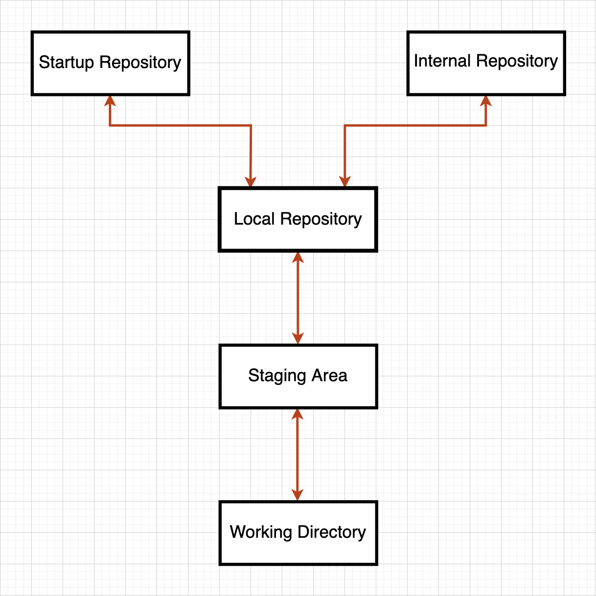

# Git - Push to Multiple Remotes.

Welcome to the guide on pushing code to multiple Git repositories hosted anywhere on the internet - from `Github` to `BitBucket` to `Gitlab` and more.

The first and foremost step is to get accustomed to the terminology used in the guide. We primarily have five concepts and their flow can be visualized with the help of the following diagram:

    

Except for two repositories at the top, everything else outlines the basic Git workflow when working with a remote repository. Since most of you have worked with Git in some capacity, I will not bore you with the details again. Nevertheless, if you want a refresher, follow this link or ping me in your free-time - no judgements, ofc.

Coming back to the topic, the two differences from the usual workflow are the multiple remote repositories:

1. Startup Repository - The one where the production code for your startup is currently hosted (in context of the guide, GitLab).

2. Internal Repository - The one used by `We Over I` to manage internal PR reviews (in context of the guide, Github).

Another important thing to note before starting off is that we use the following branching structure throughout the guide.

- main
- staging
- dev

The developers are required to create branches from the `dev` branch in order to make any changes to the code, and the changes are only integrated to `dev` through pull requests on both the `startup` repository and the `internal` repository.

---

## The Idea.

`We Over I` intends to create a workflow where no changes are pushed to `startup` repository unless it has been reviewed by someone internally. However, since it is not feasible to get everyone added to each `startup` repository, the company intends to create `internal` repositories that are kept in sync with the `startup` repositories by following a set of steps.

---

## Getting Started.

Now that you understand some terminology and the context behind this effort, you'd have a very legitimate question that goes like the following.

`"I have some 2000 commits and a multitude of branches, so how do I bring this record onto another repository? Oh, and also, how do I keep both these repos in sync overtime?"`

You will definitely find most your answers when you get some hands-on practice, but to get there, you must start by creating a carbon-copy of the existing repository with some 2000 commits and a multitude of branches. To undertake this action, please head to [configuring-remotes](guides/configuring-remotes.md) and follow the steps.

---

## Creating your First Pull Request on Internal.

The next step is to create your first pull request on the `internal` repository. To undertake this action, please head to [first-pull-request](guides/first-pull-request.md) and follow the steps.

---

## The Regular Workflow and Challenges.

Creating your PR on the `internal` repository was the first part of the challenge. The next step requires you to dive deep into synchronizing both the codebases continuously upon changes. To understand how, please head to [the-regular-workflow](/guides/the-regular-workflow.md) and read through various cases.

---

## FAQs.

Please click [here](/FAQs.md) for FAQs.
