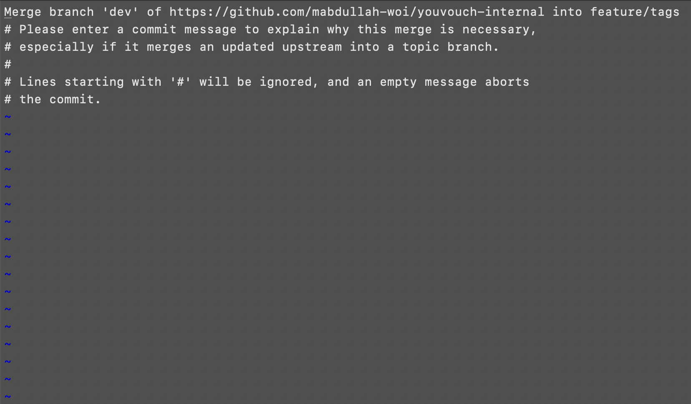

# CASE 5: Internal Not Merged, Reviewer Busy.

Suppose you show up to work the next day to find that your PR has not been merged on the `internal` repository because the reviewer did not get the time to review your changes. However, you want to get started with your work for the day.

There are two scenarios here.

- Your tasks depend on the changes you pushed yesterday.
- Your tasks do not depend on the changes you pushed yesterday.

For the first one, pull the branch you pushed yesterday by following STEP 1 and STEP 2 of [case-four](/guides/cases/case-four.md). Then, create a new branch from the pulled branch, make your changes there, push this branch to the `internal` repository and create a new PR from this branch to `dev`.

However, if your changes do not depend on the changes you pushed yesterday, follow the following steps instead.

---

### STEP 1: Switch to `dev`.

Unless you necessarily need to make changes to the latest deployed code, do not to pull code from the `dev` branch of the `startup` repository. This will ensure minimal merge conflicts on the `internal` repository.

```
git switch dev
```

### STEP 2: Create a new branch and start working on your tasks.

The following commands create a branch named `feature/tags` and then switch to it. Ensure that you create this branch when on `dev`.

```
git branch feature/tags
git switch feature/tags
```

### STEP 3: Commit your changes and push them to the `internal` repository

```
git add .
git commit -m "<message-here>"
git push internal feature/tags
```

### STEP 4: Switch to `dev` and delete the recently pushed branch from the `working directory`.

```
git switch dev
git branch -D feature/tags
```

### STEP 5: Go to the `internal` repository and create a PR to merge this branch to `dev`.

This step is carried out from the UI.

If you need to work on more tasks right away, repeat this case from `STEP 1 to STEP 5`.

> If the changes are merged in a couple hours and you want to push these changes to the `startup` repository before calling it a day, move onto STEP 6. Otherwise, continue from STEP 6 or [case-one](/guides/cases/case-one.md) guide whenever you want to push these changes to the `startup` repository.

### STEP 6: Switch to `dev` branch in your `working directory` and pull changes from `dev` on the `startup` repository.

```
git switch dev
git pull startup dev
```

### STEP 7: Create a new branch from `dev` - it will be pushed to the `startup` repository later.

It can have the same name as the one you deleted earlier when you pushed changes to the `internal` repository, but it is important that you delete the previous one and create a new one.

```
git branch feature/tags
git switch feature/tags
```

### STEP 8: Pull changes from `dev` branch of the `internal` repository on this new branch.

```
git pull internal dev
```

If the command above throws an error, add the `--no-rebase` flag. Please try running the command without the flag every single time and only use the flag if you get an error.

```
git pull internal dev --no-rebase
```

If there are merge conflicts, you must resolve them, stage the changes and commit them.

```
git add .
git commit -m "<message-here>"
```

If no conflicts are found, Git will prompt you to add a message for the merge commit. Unless you have configured your default Git editor to some other editor, a weird screen like the following will appear.

<p align="center">
    
</p>

The first line shows the commit message. To enter editing mode, press `I` on your keyboard, update the message and press the `esc` key on the keyboard. Then, press `shift` + `;` simultaneously on your keyboard, write `wq` and press the `return/enter` key.

### STEP 9: Push this branch to the `startup` repository.

```
git push startup feature/tags
```

### STEP 10: Go to the `startup` repository and create a PR to merge the branch to `dev`.

This step is carried out from the UI.

### STEP 11: Delete the branch from `working directory`.

Please confirm that you pushed your changes to the `startup` repository before deleting the branch.

```
git switch dev
git branch -D feature/tags
```
