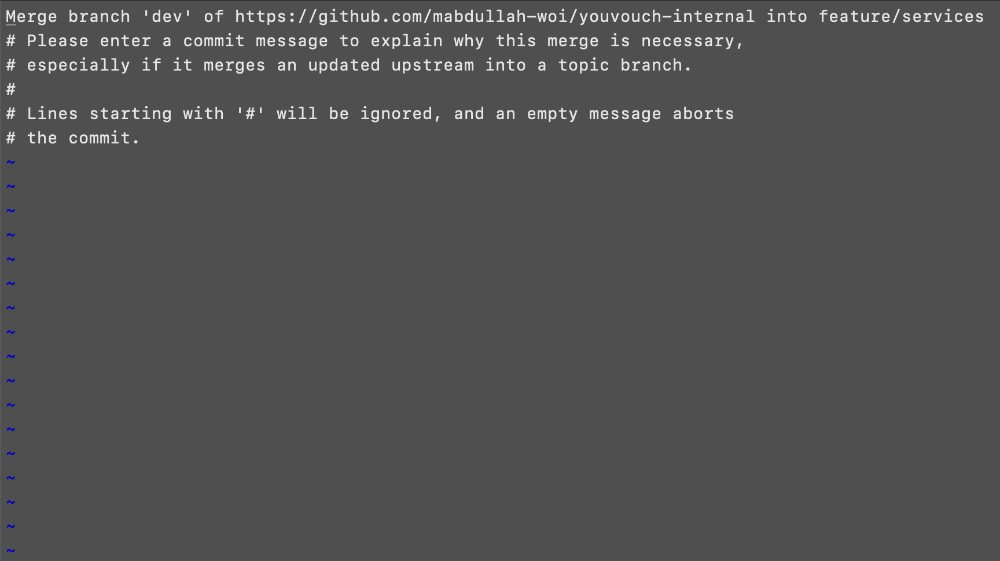

# CASE 4: Internal Not Merged, Requires Edits.

Suppose you show up to work the next day to find that your PR has not been merged on the `internal` repository because the reviewer requested for some changes. The ideal course of action would be to make those changes before starting off with your new tasks for the day. Follow the following steps to undertake those fixes.

---

### STEP 1: Fetch the branch you pushed to the `internal` respository yesterday.

```
git fetch internal feature/categories
```

### STEP 2: Create a `local` branch from the fetched branch.

```
git switch feature/categories
```

### STEP 3: Make the requested changes on the branch and commit.

```
git add .
git commit -m "<message-here>"
```

### STEP 4: Push this branch to the `internal` repository again.

```
git push internal feature/categories
```

> Now, if you want to work on some new task while your `internal` PR gets reviewed, you can move to `STEP 5`. Try not to pull `dev` from the `startup` repository to avoid any conflicts in the `internal` repository when merging the previous PR. You can always resolve the conflicts later before pushing code to the `startup` remote upon `internal` approval.

### STEP 5: Create a new branch and start working on your tasks.

The following commands create a branch named `feature/services` and then switch to it. Ensure that you create this branch when on `dev`.

```
git branch feature/services
git switch feature/services
```

### STEP 6: Commit your changes and push them to the `internal` repository.

```
git add .
git commit -m "<message here>"
git push internal feature/services
```

### STEP 7: Switch to `dev` and delete the recently pushed branch from the `working directory`.

```
git switch dev
git branch -D feature/services
```

### STEP 8: Go to the `internal` repository and create a PR to merge this branch to `dev`.

This step is carried out from the UI.

If you need to work on more tasks right away, repeat this case from `STEP 3 to STEP 6`. Try not to pull `dev` from the `startup` repository this time to avoid any conflicts in the `internal` repository. You can always resolve them later before pushing the code to the `startup` repository upon `internal` approval.

> If the changes are merged in a couple hours and you want to push these changes to the `startup` repository before calling it a day, move onto STEP 9. Otherwise, continue from STEP 9 or [case-one](/guides/cases/case-one.md) guide whenever you want to push these changes to the `startup` repository.

### STEP 9: Switch to `dev` branch in your `working directory` and pull changes from `dev` on the `startup` repository.

```
git switch dev
git pull startup dev
```

### STEP 10: Create a new branch from `dev` - it will be pushed to the `startup` repository later.

It can have the same name as the one you deleted earlier when you pushed changes to the `internal` repository, but it is important that you delete the previous one and create a new one.

```
git branch feature/services
git switch feature/services
```

### STEP 11: Pull changes from `dev` branch of the `internal` repository on this new branch.

```
git pull internal dev
```

If the command above throws an error, add the `--no-rebase` flag. Please try running the command without the flag every single time and only use the flag if you get an error.

```
git pull internal dev --no-rebase
```

If there are merge conflicts, you must resolve them, stage the changes and commit them.

```
git add .
git commit -m "<message-here>"
```

If no conflicts are found, Git will prompt you to add a message for the merge commit. Unless you have configured your default Git editor to some other editor, a weird screen like the following will appear.

<p align="center">
    
</p>

The first line shows the commit message. To enter editing mode, press `I` on your keyboard, update the message and press the `esc` key on the keyboard. Then, press `shift` + `;` simultaneously on your keyboard, write `wq` and press the `return/enter` key.

### STEP 12: Push this branch to the `startup` repository.

```
git push startup feature/services
```

### STEP 13: Go to the `startup` repository and create a PR to merge the branch to `dev`.

This step is carried out from the UI.

### STEP 14: Delete the branch from `working directory`.

Please confirm that you pushed your changes to the `startup` repository before deleting the branch.

```
git switch dev
git branch -D feature/services
```
