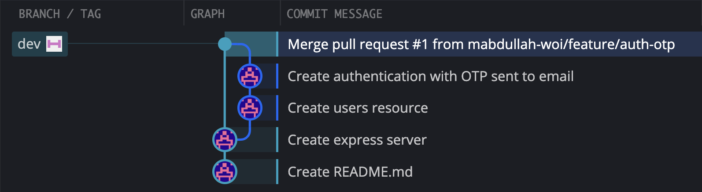
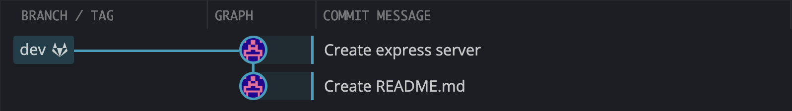
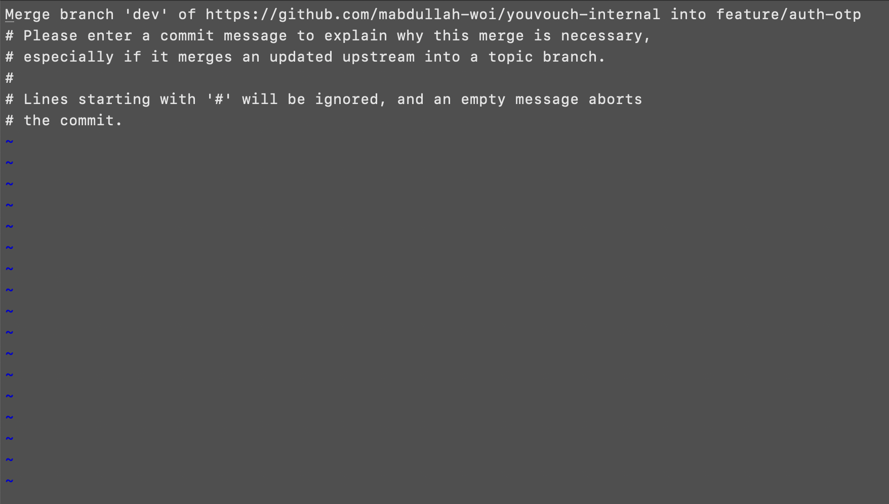

# CASE 1: Internal Merged, Not Pushed to Startup.

Suppose that you create a PR on the `internal` repository before wrapping up your work on a Thursday. However, it gets merged late at night or the next morning before you start your work again. The `dev` branch for the `internal` repository will appear something like the following in a GUI.

<p align="center">
    
</p>

In comparison, the `dev` branch for the `startup` respository appears something like the following.

<p align="center">
    
</p>

This is a fast-forward merge, but it may not always be the case. If some other developer pushed some changes when you were away or you pushed some critical fixes directly to the `startup` repository, the `dev` branch for the `startup` repository would diverge from the `dev` branch of the `internal` repository. You can visualize the divergence by comparing the third commit from the following picture to the third commit in the first picture.

<p align="center">
    
</p>

Since the third commit is not the same, you must figure out a strategy to sync both the branches again before starting a new task. The following steps outline the process.

---

### STEP 1: Switch to `dev` branch in your `working directory` and pull changes from `dev` on the `startup` repository.

```
git switch dev
git pull startup dev
```

### STEP 2: Create a new branch from `dev` - it will be pushed to the `startup` repository later.

It can have the same name as the one you deleted yesterday when you pushed changes to the `internal` repository, but it is important that you delete the previous one and create a new one.

```
git branch feature/auth-otp
git switch feature/auth-otp
```

### STEP 3: Pull changes from `dev` branch of the `internal` repository on this new branch.

```
git pull internal dev
```

If the command above throws an error, add the `--no-rebase` flag. Please try running the command without the flag every single time and only use the flag if you get an error.

```
git pull internal dev --no-rebase
```

If there are merge conflicts, you must resolve them, stage the changes and commit them.

```
git add .
git commit -m "<message-here>"
```

If no conflicts are found, Git will prompt you to add a message for the merge commit. Unless you have configured your default Git editor to some other editor, a weird screen like the following will appear.

<p align="center">
    
</p>

The first line shows the commit message. To enter editing mode, press `I` on your keyboard, update the message and press the `esc` key on the keyboard. Then, press `shift` + `;` simultaneously on your keyboard, write `wq` and press the `return/enter` key.

### STEP 4: Push this branch to the `startup` repository.

```
git push startup feature/auth-otp
```

### STEP 5: Go to the `startup` repository and create a PR to merge the branch to `dev`.

This step is carried out from the UI.

### STEP 6: Delete the branch from `working directory`.

Please confirm that you pushed your changes to the `startup` repository before deleting the branch.

```
git switch dev
git branch -D feature/auth-otp
```

### STEP 7: Pull `dev` branch from the `startup` repository again.

Please ensure that you are on the `dev` branch of your `working directory` before executing this command.

```
git pull startup dev
```

### STEP 8: Push `dev` branch to the `internal` repository.

```
git push internal dev
```

If this throws an error, switch to the `main` branch, delete the `dev` branch on the `internal` repository and push `dev` again. This will not remove any PR records on the `internal` repository except for the last one, which you can recover the next time you sync both the repositories.

```
git switch main
git push internal -d dev
git switch dev
git push internal dev
```

### STEP 9: Create a new branch and start working on your tasks.

The following commands create a branch named `feature/survey` and then switch to it. Ensure that you create this branch when on `dev`.

```
git branch feature/survey
git switch feature/survey
```

### STEP 10: Commit your changes and push them to the `internal` repository.

```
git add .
git commit -m "<message here>"
git push internal feature/survey
```

### STEP 11: Switch to `dev` and delete the recently pushed branch from the `working directory`.

```
git switch dev
git branch -D feature/survey
```

### STEP 12: Go to the `internal` repository and create a PR to merge this branch to `dev`.

This step is carried out from the UI. Once the PR is reviewed and merged, repeat the first six steps of this case to push changes to the `startup` repository again.
