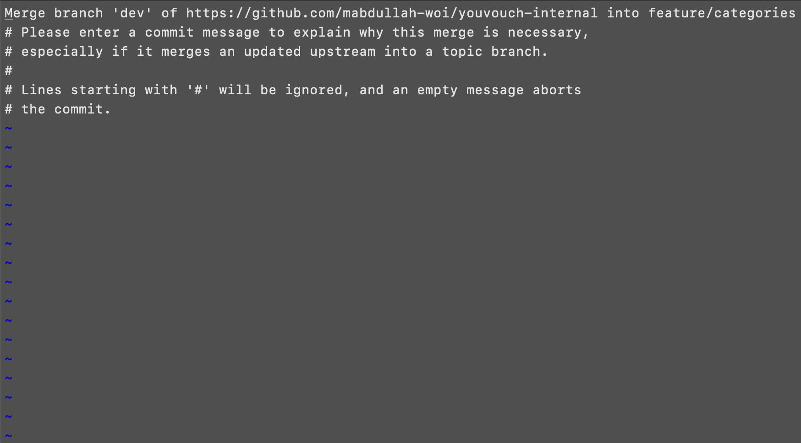

# CASE 3: Merged on Both Repositories.

Suppose you create a PR on the `internal` repository on Thursday and it gets merged to `dev` before you wrap up. Therefore, you push these changes to the `startup` repository before shutting down your development machine and come back the next day to find your PR merged to `dev` on the `startup` repository.

Now, before you start working on your new tasks, you must synchronize both the remote repositories to reduce merge conflicts down the line. These steps illustrate how.

---

### STEP 1: Switch to `dev` branch in your `working directory` and pull changes from `dev` on the `startup` repository.

```
git switch dev
git pull startup dev
```

### STEP 2: Push `dev` branch to the `internal` repository.

```
git push internal dev
```

If this throws an error, switch to the `main` branch, delete the `dev` branch on the `internal` repository and push `dev` again. This will not remove any PR records on the `internal` repository except for the last one, which you can recover the next time you sync both the repositories.

```
git switch main
git push internal -d dev
git switch dev
git push internal dev
```

### STEP 3: Create a new branch and start working on your tasks.

The following commands create a branch named `feature/categories` and then switch to it. Ensure that you create this branch when on `dev`.

```
git branch feature/categories
git switch feature/categories
```

### STEP 4: Commit your changes and push them to the `internal` repository.

```
git add .
git commit -m "<message here>"
git push internal feature/categories
```

### STEP 5: Switch to `dev` and delete the recently pushed branch from the `working directory`.

```
git switch dev
git branch -D feature/categories
```

### STEP 6: Go to the `internal` repository and create a PR to merge this branch to `dev`.

This step is carried out from the UI.

If you need to work on more tasks right away, repeat this case from `STEP 3 to STEP 6`. Try not to pull changes this time around to avoid any conflicts.

> If the changes are merged in a couple hours again and you want to push these changes to the `startup` repository before calling it a day, move onto STEP 7. Otherwise, continue from STEP 7 or [case-one](/guides/cases/case-one.md) guide whenever you want to push these changes to the `startup` repository.

### STEP 7: Switch to `dev` branch in your `working directory` and pull changes from `dev` on the `startup` repository.

```
git switch dev
git pull startup dev
```

### STEP 8: Create a new branch from `dev` - it will be pushed to the `startup` repository later.

It can have the same name as the one you deleted earlier when you pushed changes to the `internal` repository, but it is important that you delete the previous one and create a new one.

```
git branch feature/categories
git switch feature/categories
```

### STEP 9: Pull changes from `dev` branch of the `internal` repository on this new branch.

```
git pull internal dev
```

If the command above throws an error, add the `--no-rebase` flag. Please try running the command without the flag every single time and only use the flag if you get an error.

```
git pull internal dev --no-rebase
```

If there are merge conflicts, you must resolve them, stage the changes and commit them.

```
git add .
git commit -m "<message-here>"
```

If no conflicts are found, Git will prompt you to add a message for the merge commit. Unless you have configured your default Git editor to some other editor, a weird screen like the following will appear.

<p align="center">
    
</p>

The first line shows the commit message. To enter editing mode, press `I` on your keyboard, update the message and press the `esc` key on the keyboard. Then, press `shift` + `;` simultaneously on your keyboard, write `wq` and press the `return/enter` key.

### STEP 10: Push this branch to the `startup` repository.

```
git push startup feature/categories
```

### STEP 11: Go to the `startup` repository and create a PR to merge the branch to `dev`

This step is carried out from the UI.

### STEP 12: Delete the branch from `working directory`.

Please confirm that you pushed your changes to the `startup` repository before deleting the branch.

```
git switch dev
git branch -D feature/categories
```
