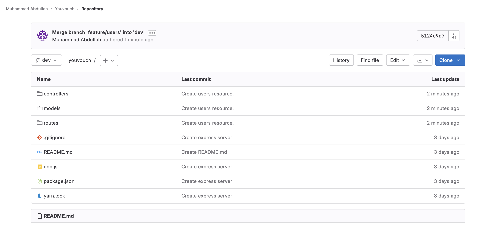
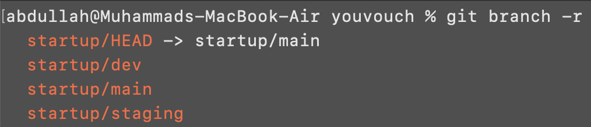
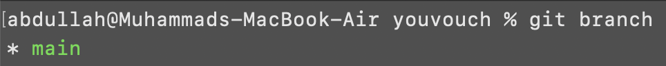
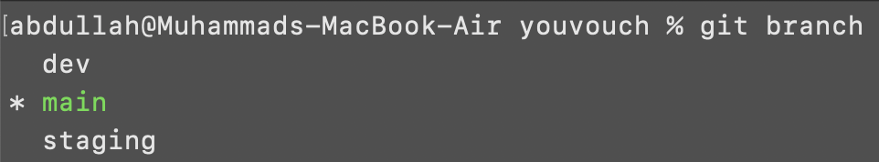

# Configuring Remotes.

> Only one person per product team needs to replicate the codebase between remote repositories. However, except for the last step, each contributing member needs to complete all the other steps.

> Also, I recommend you delete the existing codebase from your system and follow the guide to help you set things up again.

Suppose you have a `startup` repository on `Gitlab` with a good number of branches and commits.

<p align="center">
    
</p>

To work on this repository, you need to clone this repository to your machine. You can use the following command for the purpose, where you must replace `<url>` with the one for your repository.

```
git clone <url>
```

In my case, I need to execute the following command inside the folder I want to clone this repository.

```
git clone https://gitlab.com/mabdullah-woi/youvouch.git
```

---

## Renaming Remote.

Once you have the clone, navigate to the repository inside the terminal and execute the following command.

```
git remote -v
```

The output for the command should look something like the following, where you'd have an `origin` for fetching and pushing changes.

<p align="center">
    
</p>

This `origin` points to the URL you used for cloning the repository - in other words, it refers to the `startup` repository.

To avoid any inconveniences down the line, you should rename `origin` to `startup` before you move forward. Execute the following command for the purpose.

```
git remote rename origin startup
```

Now, if you execute `git remote -v` again, it would show something like the following.

<p align="center">
    
</p>

---

## Adding Another Remote.

Next up, you need to add another remote repository to the list of remotes. This would be the `internal` repository and will be created for you beforehand.

For demonstration purposes, I have created one myself over on GitHub. Note that the name of the repository is slightly different from the original one - it should not pose a problem. Also, the repository is completely empty - no README, .gitignore etc.

<p align="center">
    
</p>

Copy the URL from the `Quick Setup` section and execute the following command after replacing `<url>` with the one for your repository.

```
git remote add internal <url>
```

In my case, I need to execute the following command.

```
git remote add internal https://github.com/mabdullah-woi/youvouch-internal.git
```

Now, if you execute `git remote -v`, it would show something like the following.

<p align="center">
    
</p>

---

## Pulling Startup Repository to Working Directory.

The next step is to pull the complete `startup` repository from Gitlab to your `working directory`.

First up, execute the following command to fetch all the branches from the `startup` repository to your `local` repository.

```
git fetch startup
```

You can confirm that all the branches were fetched by executing the following command.

```
git branch -r
```

In my case, I have three branches and `startup/HEAD` (remote HEAD pointer) points to `startup/main`.

<p align="center">
    
</p>

These branches were fetched to your `local` repository, but they have not been added to your `working directory` yet. So, if you were to list the branches in your `working directory` by executing `git branch`, you would see the following output.

<p align="center">
    
</p>

To create a new branch in your `working directory` for each branch in the `local` repository, execute the following command. Note that `HEAD` was pointing to `startup/main` in my case, so the command contains `"HEAD|main"`. If that is not the case for you, replace `main` with the branch your `HEAD` points to before executing.

```
for i in $(git branch -r | grep -vE "HEAD|main"); do git branch --track ${i#*/} $i; done
```

Once the execution finishes, list all the branches in your `working directory` by executing the following command again.

```
git branch
```

The output should now contain a branch for each listed in the output of `git branch -r` earlier, without the prefix `startup/`.

<p align="center">
    
</p>

---

> This step only needs to be completed by one developer from each product team. All the other should move back to README.md for further instructions.

## Pushing Working Directory to Internal Repository.

Currently, your `working directory` is in sync with the `startup` repository, but your `internal` repository is empty.

<p align="center">
    
</p>

To create a carbon-copy of the `startup` repository on your `internal` repository, you must push all the branches from `working directory` to the `internal` repository. Execute the following command for the purpose.

```
git push internal --all
```

Now, if you navigate to your `internal` repository again or refresh the Github page, you should see all your changes added to your `internal` repository.

<p align="center">
    
</p>

Congratulations, you replicated the repository across two remotes successfully. Move back to README.md for further instructions.

